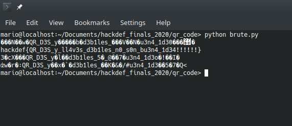

# QR Code

### Resuelto por Manjaro

### Descripcion del Reto

A partir de otro reto, nos daban un codigo QR para decodificar. junto con el script que encripto el mensaje y lo genero.
```python
from Crypto.Cipher import DES
import pyqrcode
import binascii

f = open('llave.txt', 'r')
llave = f.read()
f.close()

f =  open('bandera.txt','r')
bandera = f.read()
f.close()

assert llave[8:] != llave[:8]

if (llave[8:][0:2] == llave[8:][2:4] == llave[8:][4:6] == llave[8:][6:8]) and (llave[:8][0:2] == llave[:8][2:4] == llave[:8][4:6] == llave[:8][6:8]):
	key = binascii.unhexlify(llave)
	iv ='87654321'
	a = DES.new(key, DES.MODE_OFB,iv)
	cifrado = a.encrypt(bandera)
	qr = pyqrcode.create(cifrado.hex())
	qr.png("bandera.png",scale=6)
	print("Bandera cifrada satisfactoriamente")
else:
	print("La llave no cumple con la condicion")
```


Al escanearlo regresa un string hexadecimal que es nuestro mensaje encriptado.
**b7f65a38f2c2dcba6965697107606d4880fb5567e094c99e5c0454045856416eb1a76620a6c9e5a34d0458016b025602ebb61872b7869bbc**

### Solucion

Al checar el codigo proporcionado, vemos que usaron **DES** para encriptar el mensaje y a partir del *assert* y el *if* nos damos cuenta que la llave es simplemente formada por **2 caracteres repetidos**, por ejemplo "aaaabbbb".

Al intentar hacer un pequeño script para hacer bruteforce a la llave, no tomamos en cuenta todos lo caracteres posibles y no funciono. Haciendo mas lectura y a partir de esta pagina [Weak_Key](https://en.wikipedia.org/wiki/Weak_key) sacamos la flag.
```python
from Crypto.Cipher import DES
import binascii

IV = '87654321'
h = "b7f65a38f2c2dcba6965697107606d4880fb5567e094c99e5c0454045856416eb1a76620a6c9e5a34d0458016b025602ebb61872b7869bbc"
ciphertext = binascii.unhexlify(h)

KEY=b'\x00\x00\x00\x00\x00\x00\x00\x00'
a = DES.new(KEY, DES.MODE_OFB, IV)
plaintext = a.decrypt(ciphertext)
print plaintext

KEY=b'\x1E\x1E\x1E\x1E\x0F\x0F\x0F\x0F'
a = DES.new(KEY, DES.MODE_OFB, IV)
plaintext = a.decrypt(ciphertext)
print plaintext

KEY=b"\xE1\xE1\xE1\xE1\xF0\xF0\xF0\xF0"
a = DES.new(KEY, DES.MODE_OFB, IV)
plaintext = a.decrypt(ciphertext)
print plaintext

KEY=b"\xFF\xFF\xFF\xFF\xFF\xFF\xFF\xFF"
a = DES.new(KEY, DES.MODE_OFB, IV)
plaintext = a.decrypt(ciphertext)
print plaintext
```


Y voila: **hackdef{QR_D3S_y_ll4v3s_d3b1les_n0_s0n_bu3n4_1d34!!!!!!}**
