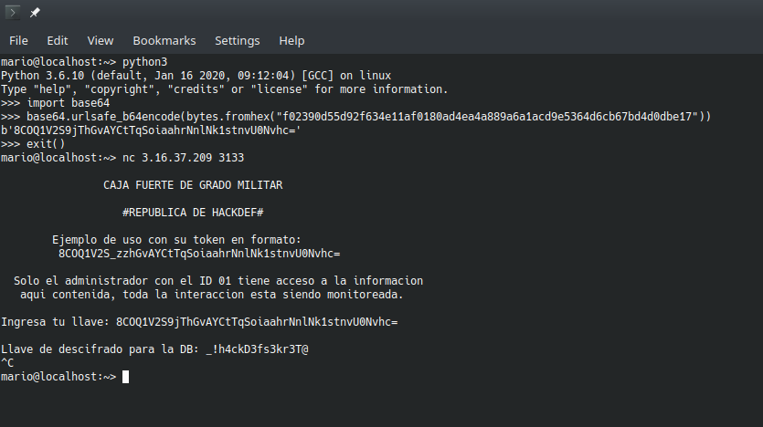

# Safe Vault

### Resuelto por Manjaro

### Descripcion del Reto

Este fue mi favorito.
Aqui nos explican que tenemos que usar un servicio remoto **safe.py** para obtener la *llave* necesaria para desencriptar un archivo de la base de datos **database_export.bin** usando el *script proporcionado* **encrypt-decrypt_db.py**.

safe.py:
```python
import socketserver
import base64
import random
import string
from Crypto.Cipher import AES
from Crypto.Util.Padding import pad, unpad
from secreto import key

logo ='''
                CAJA FUERTE DE GRADO MILITAR
 
                   #REPUBLICA DE HACKDEF#

        Ejemplo de uso con su token en formato: 
         8COQ1V2S_zzhGvAYCtTqSoiaahrNnlNk1stnvU0Nvhc=
    
  Solo el administrador con el ID 01 tiene acceso a la informacion
   aqui contenida, toda la interaccion esta siendo monitoreada.
'''

with open("flag.txt") as f:
    flag = f.readline()

def decrypt_safe(iv, admin_token):
    try:
        ciphertext = base64.urlsafe_b64decode(admin_token)
        cipher = AES.new(bytes(key,"utf-8"), AES.MODE_CBC, bytes(iv,"utf-8"))
        decrypted_token = unpad(cipher.decrypt(ciphertext), AES.block_size)
        return decrypted_token
    except:
        return b"Error!!!"

class Safe(socketserver.BaseRequestHandler):
    def handle(self):
        iv = '\x66' * 16
        self.request.send(bytes(logo,"utf-8"))
        while True:
            self.request.send(b"\r\nIngresa tu llave: ")
            key = self.request.recv(1024).strip()
            administrador_id = decrypt_safe(iv, key)
            print(administrador_id)
            if b"Error" in administrador_id :
                self.request.send(b"\r\nAlgo salio mal...")
                continue
            if administrador_id[22:24] == b"01":
                self.request.send(b"\r\nLlave de descifrado para la DB: ")
                self.request.send(bytes(flag,"utf-8"))
                break
            else:
                self.request.send(b"\r\nID incorrecto: %s, intente nuevamente..." % administrador_id[22:24])
                continue

if __name__ == "__main__":
    HOST, PORT = "0.0.0.0", 3102
    server = socketserver.ThreadingTCPServer((HOST, PORT), Safe)
    server.allow_reuse_address = True
    server.serve_forever()
```

Al analizar el codigo y ejecutando (jugando con) el servicio, nos damos cuenta que necesitamos pasarle un *hexadecimal* codificado en **base64** que al desencriptarlo, el servicio obtenga el **id 01**, correpondiente al "admin" ya asi nos devuelva la *flag*.

### Solucion

El cifrado es AES con una **llave** (siempre igual) y **iv** ('\x66' * 16, siempre igual).
El servicio solo recibia el mensaje a desencriptar, asi que determinamos que teniamos que modificar el que ya nos daban para que **id = 01**.
Usando bit flipping, hicimos un script para hacer bruteforce hasta que el servicio nos regresara un id diferente al **99** original con el b64 del ejemplo **8COQ1V2S_zzhGvAYCtTqSoiaahrNnlNk1stnvU0Nvhc=**

```python
from pwn import *
import base64

pad = 16
h = "f02390d55d92ff3ce11af0180ad4ea4a889a6a1acd9e5364d6cb67bd4d0dbe17"

iv = '\x66' * 16
for i in range(11,16):
    for x in list("0123456789abcdef"):
        r = remote('3.16.37.209', 3133)
        #r = process('./chall.sh'

        data = h[:i]+x+x+h[i+2:]
        r.sendlineafter('Ingresa tu llave:', base64.urlsafe_b64encode(bytes.fromhex(data)))
        r.recvline()

        try:
            msg = r.recvline().decode("utf-8")

            if 'Algo salio mal...' not in msg and '99' not in msg:
                print(msg,end='')
                print(i,x)
                print(data)
            r.close()
        except Exception as e:
            pass```

Comparando el b64 original decodificado: *f02390d55d92ff3ce11af0180ad4ea4a889a6a1acd9e5364d6cb67bd4d0dbe17* con los resultantes del script que tuvieran 0 y 1 en el id, cambiamos esas dos posiciones y codificamos en b64 para asi sacar la flag.

posicion, caracter sustituto y hexadecimal:
13 6 *f02390d55d92f63ce11af0180ad4ea4a889a6a1acd9e5364d6cb67bd4d0dbe17*
15 4 *f02390d55d92ff34e11af0180ad4ea4a889a6a1acd9e5364d6cb67bd4d0dbe17*

hexadecimal resultante: *f02390d55d92f634e11af0180ad4ea4a889a6a1acd9e5364d6cb67bd4d0dbe17*



Ya con la llave, usamos el script para decodificar la base de datos y sacar la flag:
**hackdef{b1t_fl1pp1ng-strik3sback!!}**