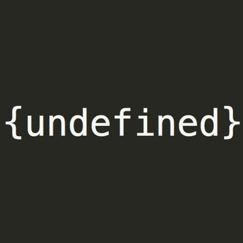

# Hackdef-Finals-2020

En este repositorio encontrarás la solución de los retos del Hackdef-Finals-2020. 
El CTF universitario más grande de México en donde participaron 10 equipos a nivel nacional,
mismo en el que obtuvimos el lugar 4.

# Equipo

## Undefined

## Categorías

```
Web
Reversing
Pwning
Crypto
```

## Miembros del equipo:

+[Von](https://github.com/developer-jesus-github)
+[Vanski](https://github.com/ivanmedina)
+[Diego](https://github.com/Drdzmtz)
+[Manjaro](https://github.com/mariomanza150)

## Remember us and remember that we lived


